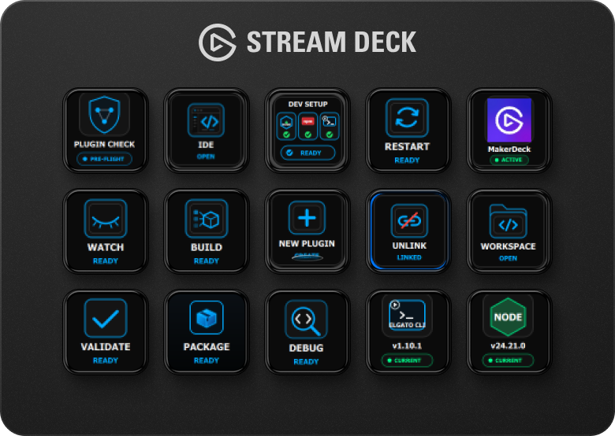
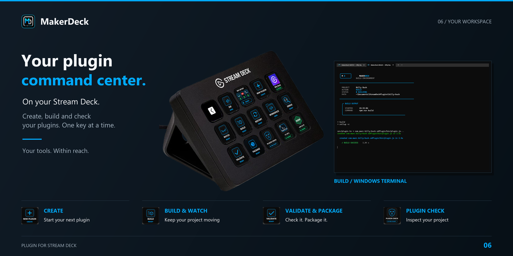
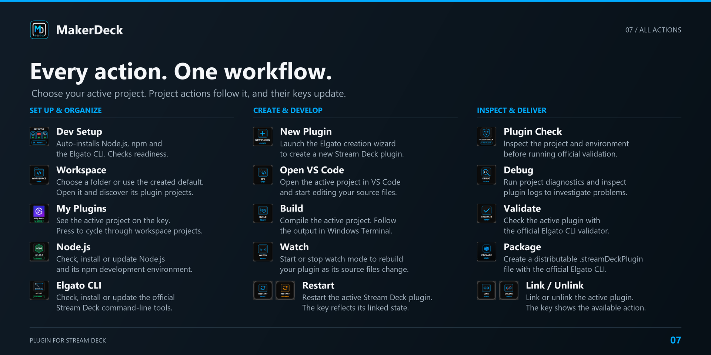
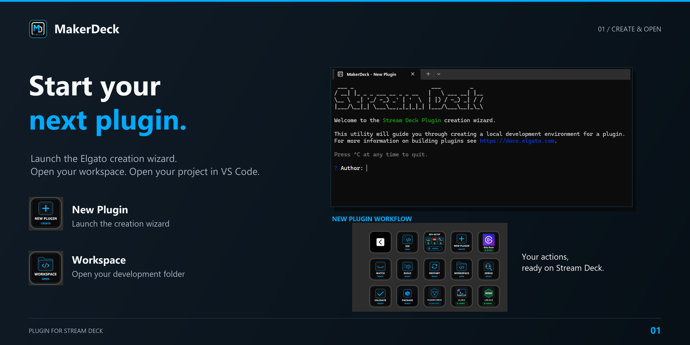
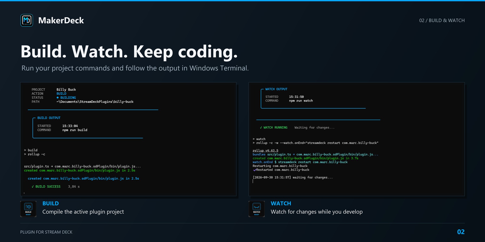
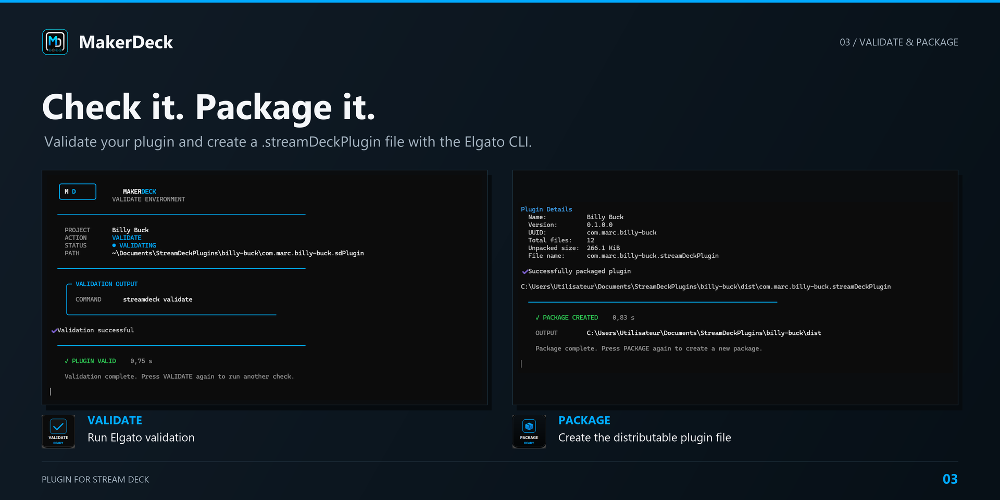
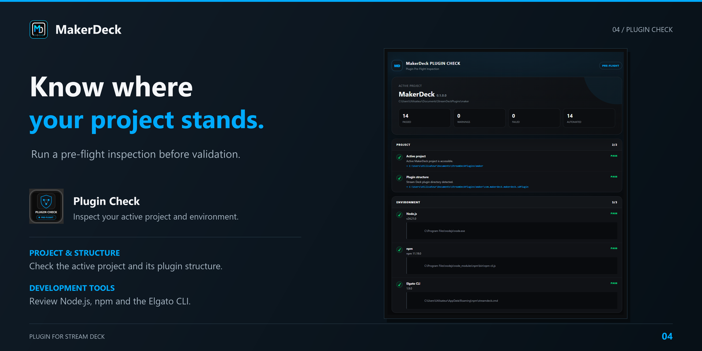
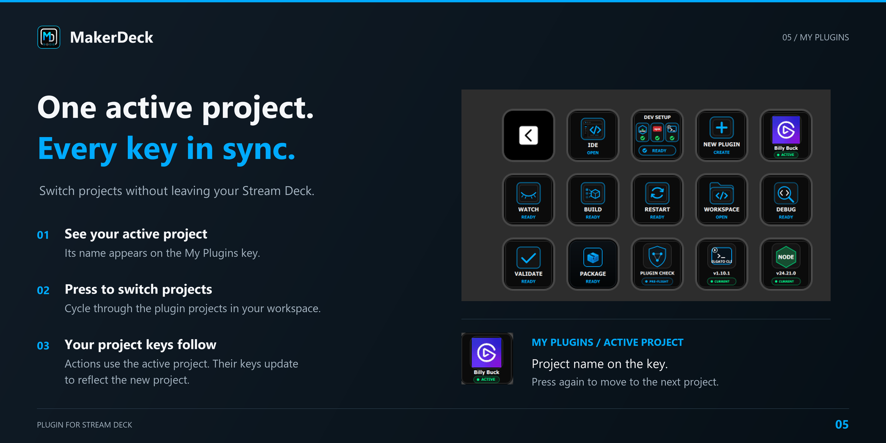

<strong>15 actions. One active project. Your development tools at your fingertips.</strong>

  
  
  
  

**Marketplace status: submitted for review on October 2, 2026.** MakerDeck is a paid plugin. The Marketplace link will be added after approval and publication.

MakerDeck turns your Stream Deck into a command center for Stream Deck plugin development. Prepare your tools, switch projects, build, watch, inspect and package your plugin from your keys.

This repository contains product information, documentation and support resources. MakerDeck's source code and installation package are not distributed here.

[Getting started](docs/GETTING-STARTED.md) · [All actions](#all-15-actions) · [Release notes](docs/CHANGELOG.md) · [Support](docs/SUPPORT.md)

## Your development workspace, within reach

- **Set up your tools:** Dev Setup installs Node.js, npm and the official Elgato CLI when needed, then checks readiness.
- **Choose your project:** My Plugins shows the active project and cycles through projects in your workspace. Project actions follow that selection.
- **Keep working:** Build and Watch run your project commands using Windows Terminal.
- **Prepare delivery:** Plugin Check, Debug, Validate and Package help you inspect and distribute your plugin.

MakerDeck uses Windows Terminal and the official Elgato CLI. It does not include an integrated terminal or replace the Elgato development tools.

## All 15 actions

| Action | What it does |
|---|---|
| **Dev Setup** | Installs missing Node.js, npm and Elgato CLI tools and checks environment readiness. |
| **Workspace** | Configures and opens the development folder. A default folder is created when no workspace is configured. Projects are discovered inside the workspace. |
| **My Plugins** | Shows the active project. Press to cycle through workspace projects; project actions follow the selection. |
| **Node.js** | Checks, installs or updates the Node.js development environment. |
| **Elgato CLI** | Checks, installs or updates the official Stream Deck CLI. |
| **New Plugin** | Opens the official Elgato plugin creation wizard. |
| **Open VS Code** | Opens the active project in Visual Studio Code. |
| **Build** | Compiles the active project and shows output in Windows Terminal. |
| **Watch** | Starts or stops watch mode to rebuild as source files change. |
| **Restart** | Restarts the active plugin in Stream Deck. |
| **Link / Unlink** | Links the active development plugin to Stream Deck or unlinks it. |
| **Plugin Check** | Inspects the project and environment before official validation. |
| **Debug** | Runs diagnostics and provides access to plugin logs. |
| **Validate** | Validates the active plugin with the official Elgato CLI. |
| **Package** | Creates a distributable `.streamDeckPlugin` file with the official Elgato CLI. |

## From first project to packaged plugin

### Create & open
Launch the creation wizard, open your workspace and start editing in VS Code.

### Build & watch
Run your development scripts and follow the output in Windows Terminal.

### Validate & package
Use the official Elgato CLI to validate your plugin and produce its distributable package.

### Plugin Check
Review the active project, plugin structure and development environment before validation. Reports are saved inside the project at `.makerdeck/plugin-check/preflight-report.html`.

### My Plugins
Keep the active project visible on your Stream Deck. Press the key to move to the next workspace project; project actions update to reflect the selection.

The images use real MakerDeck assets and captured interfaces. Project names and tool versions reflect the captured sessions. The physical Stream Deck illustration combines the supplied device photo with real key images.

## Requirements

- Windows; the plugin manifest declares Windows 10 or later.
- Stream Deck software 7.1 or later.
- Windows Terminal for terminal workflows.
- Visual Studio Code for the Open VS Code action.
- Internet access to download development tools and project dependencies.
- Build and Watch depend on the corresponding scripts in the selected project.

MakerDeck provides key actions. It does not include Stream Deck + dial actions, Neo Infobar actions or bundled default profiles. Add the actions to your own layout.

## Availability & support

Version **0.1.0.0** is pending Elgato Marketplace review. Approval and publication have not yet been confirmed.

For questions, bugs or feature requests, [open an issue](https://github.com/rmncld/MakerDeck/issues). Please read the [support guide](docs/SUPPORT.md) before attaching logs or screenshots.

MakerDeck is an independent product and is not an official Elgato product. Product names and trademarks belong to their respective owners.
